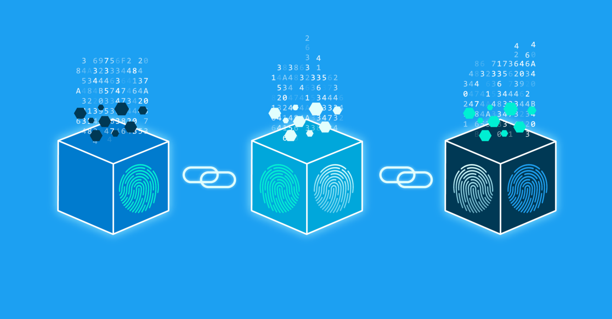
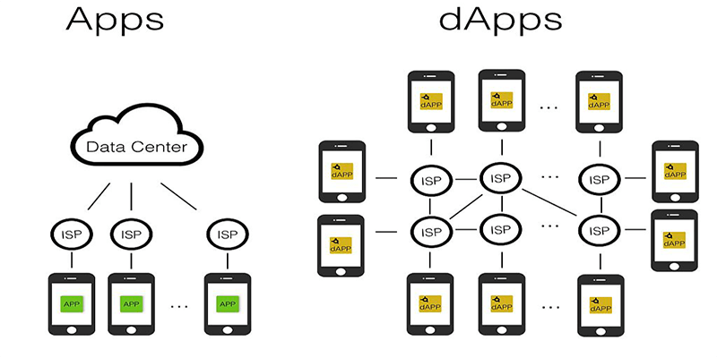

Con New Inntech, podrás explorar y desarrollar con nuevas tecnologías, en este caso la cadena de bloques o Blockchain, nos permitirá construir un mundo mas descentralizado y justo, sin la alteración indebida de documentos o manipulación de libros contables. Con Blockchain, podrás crear nuevas soluciones que ayuden a tu organización a tener mas transparencia y confiabilidad de cara al mercado.

Estamos aquí a tu disposición, para escuchar tus necesidades, ideas de negocio y hacerlas realidad. Contamos con un equipo dedicado a la innovación y desarrollo en nuevas tecnologías, con el objetivo de brindarte nuestra experiencia y ser los pioneros en incorporar tecnologías que están marcando tendencia.

## Un poco de historia

La blockchain generalmente se asocia con el Bitcoin y otras criptomonedas, pero estas son solo la punta del iceberg. Y es que esta tecnología, que tiene sus orígenes en 1991, cuando Stuart Haber y W. Scott Stornetta describieron el primer trabajo sobre una cadena de bloques asegurados criptográficamente, no fue notoria hasta 2008, cuando se hizo popular con la llegada del bitcoin. Pero actualmente su utilización está siendo demandada en otras aplicaciones comerciales y se proyecta un crecimiento anual del 51% para el 2022 en varios mercados, como el de las instituciones financieras o el de Internet de las Cosas (IoT), según publicó MarketWatch.

## Que es Blockchain?

La cadena de bloques, más conocida por el término en inglés blockchain, es un registro único, consensuado y distribuido en varios nodos de una red. En el caso de las criptomonedas, podemos pensarlo como el libro contable donde se registra cada una de las transacciones.

Su funcionamiento puede resultar complejo de entender si profundizamos en los detalles internos de su implementación, pero la idea básica es sencilla de seguir.

En cada bloque se almacena:

- una cantidad de registros o transacciones válidas,
- información referente a ese bloque,
- su vinculación con el bloque anterior y el bloque siguiente a través del hash de cada bloque ─un código único que sería como la huella digital del bloque.

Por lo tanto, cada bloque tiene un lugar específico e inamovible dentro de la cadena, ya que cada bloque contiene información del hash del bloque anterior. La cadena completa se guarda en cada nodo de la red que conforma la blockchain, por lo que se almacena una copia exacta de la cadena en todos los participantes de la red.

A medida que se crean nuevos registros, estos son primeramente verificados y validados por los nodos de la red y luego añadidos a un nuevo bloque que se enlaza a la cadena.

## ¿Por qué blockchain es tan segura?

Al ser una tecnología distribuida, donde cada nodo de la red almacena una copia exacta de la cadena, se garantiza la disponibilidad de la información en todo momento. En caso de que un atacante quisiera provocar una denegación de servicio, debería anular todos los nodos de la red, ya que basta con que al menos uno esté operativo para que la información esté disponible.

Por otro lado, al ser un registro consensuado, donde todos los nodos contienen la misma información, resulta casi imposible alterar la misma, asegurando su integridad. Si un atacante quisiera modificar la información en la cadena de bloques, debería modificar la cadena completa en al menos el 51% de los nodos.

## Desarrollo sobre plataformas Blockchain

Con New inntech, podrás desarrollar contratos inteligentes, implementaciones sobre red descentralizadas como IPFS o BTFS, según tus necesidades. Ayudamos a crear tus aplicaciones, las cuales en este caso al ser sobre tecnología Blockchain se llaman Dapps.

La gran diferencia entre una Dapp y una App, es la descentralización, como se ilustra en la siguiente imagen:

## Servicios ofrecidos por New Inntech

Nuestros clientes podrán acceder a los siguientes beneficios de consultoría y desarrollo:

- Capacitaciones sobre tecnologías Blockchain
- Desarrollos a la medida de acuerdo a las necesidades planteadas por el cliente.
- Orientación ya sea a nivel de arquitectura como conceptual sobre la tecnología Blockchain.

<InfoBanner emoji=":evergreen_tree:">
  Recuerda que para mas información, puedes contactarnos en las diferentes redes sociales o correo electrónico.
</InfoBanner>

<ButtonLink to="/eth2/">Saber mas</ButtonLink>
